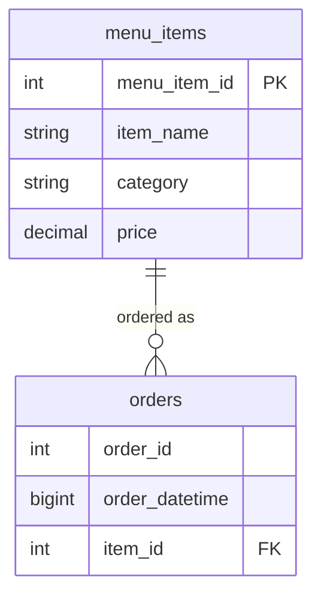

# resturant_orders

## Schema

Each row of `orders` is one item in an order, so `order_id` repeats across rows.

## Data dictionary

### menu_items (`menu_items.csv`)

| Field | Type | Description |
| --- | --- | --- |
| `menu_item_id` | int | Unique ID of a menu item |
| `item_name` | string | Name of a menu item |
| `category` | string | Category or type of cuisine of the menu item (American, Asian, Italian, Mexican) |
| `price` | decimal | Price of the menu item (US Dollars $) |

### orders (`orders.csv`)

| Field | Type | Description |
| --- | --- | --- |
| `order_id` | int | ID of an order; shared by every item in the same order |
| `order_datetime` | bigint | When the order was put in, as milliseconds since the Unix epoch (source times treated as UTC) |
| `item_id` | int | Matches the `menu_item_id` in the `menu_items` table; `NULL` in some rows |
